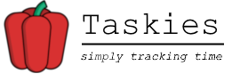

# Taskies
Taskies is a small, minimalist, and easy-to-use desktop program to help you track your tasks and their duration

---
# _Taskies is an alpha state. There are bugs!_
---

## Do you find yourself?
* Struggling to remember what you did during the day? Yesterday? Or on a day in the past?
* Struggling to formulate a stand-up update?
* Struggling to remember how long you spent on a task?
* Or to do analysis of where your time goes and to be more productive? 

## Installation
Download an installer executable from [here](https://github.com/ifexception/taskies/releases)

## Features
* Manage employers, clients, projects, and categories
* Preferences
* Task addition/modification/deletion
* Status bar task durations
* Export to CSV
* Database backups
* Open source (GPL-3 license, see [LICENSE](LICENSE) for more)

### Upcoming features
* Outlook integration
* Stopwatch/Timer
* Reminders
* Portable installation

### Bugs and/or Suggestions
* Found a bug?
* Have a suggestion?

Log an issue [here](https://github.com/ifexception/taskies/issues/new) for the developer and to track feedback

#### Libraries
* wxWidgets
* SQLite
* date.h
* fmt
* toml11
* spdlog
* nlohmann_json

See [Attributions](docs/ATTRIBUTIONS.md) for artwork
