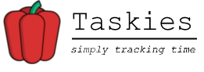

# Taskies
Taskies is a small, minimalist, and easy-to-use desktop program to help you track your tasks and their duration

---
_Taskies is still under active development_
---

### Do you find yourself?
* Struggling to remember what you did during the day? Yesterday? Or on a day in the past?
* Struggling to formulate a stand-up update?
* Struggling to remember how long you spent on a task?
* Or to do analysis of where your time goes and to be more productive? 

## Installation
Download an installer executable or portable version from [here](https://github.com/ifexception/taskies/releases)

## Features
* Manage employers, clients, projects, and categories
* Preferences
* Task addition/modification/deletion
* Task attrbutes
* Status bar task durations
* Export to CSV
* Export to Excel (Windows only)
* Reminders
* Database backups
* Outlook (classic) meetings integration (Windows only)
* Open source (GPL-3 license, see [LICENSE](LICENSE) for more)

### Bugs and/or Suggestions
* Found a bug?
* Have a suggestion?

Log an issue [here](https://github.com/ifexception/taskies/issues/new) for the developer and to track feedback

#### Libraries
* wxWidgets
* SQLite
* date.h
* fmt
* toml11
* spdlog
* ~nlohmann_json~ (removed for time being)

See [Attributions](docs/ATTRIBUTIONS.md) for artwork

##### Development
###### vcpkg (broken)
Taskies by default uses [vcpkg](https://github.com/microsoft/vcpkg) package manager to help manage dependencies.
`vcpkg` is configured using the _classic_ mode (note the file `CMakeSettings.json`)

However as of 21 January 2026 `libjpeg-turbo` build through CMake is broken. `libjpeg-turbo` is a dependency for wxWidgets.

An issue has been logged [here](https://github.com/microsoft/vcpkg/issues/49532) and there is no timeline for a fix :(

###### conan (current)
Taskies has thus shifted to using [conan](https://conan.io/) to manage dependencies.
An option to develop Taskies via `.sln` file has been added and because MSBuild is being used, the Conan Visual Studio extension is being leveraged to manage dependencies.

[Blog announcement](https://blog.conan.io//2024/03/21/Introducing-new-conan-visual-studio-extension.html)

The extension is *required**
